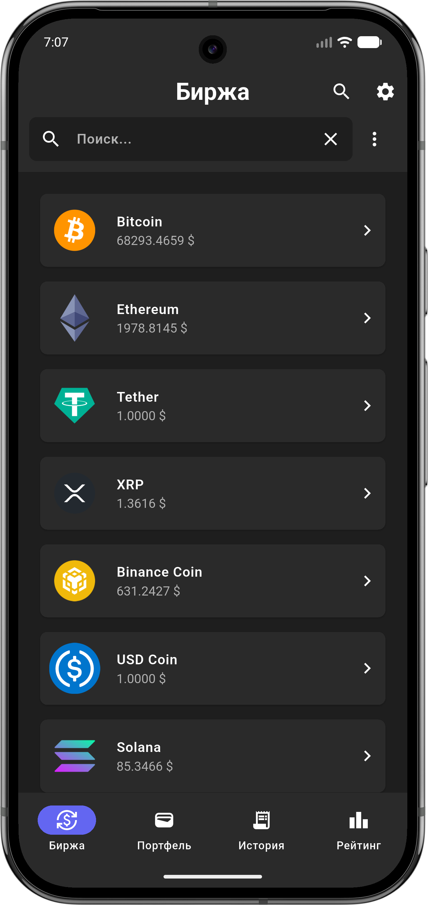
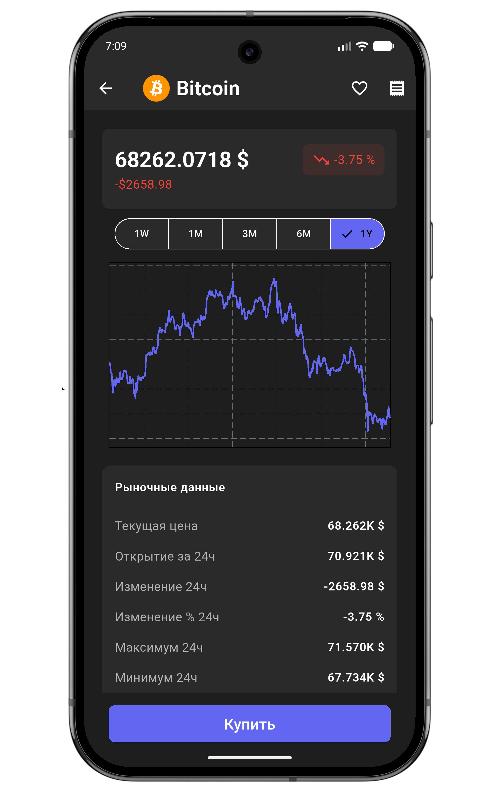
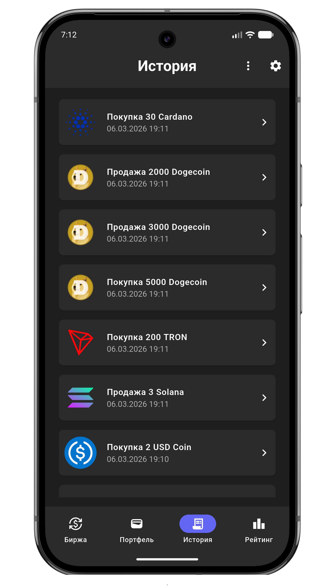
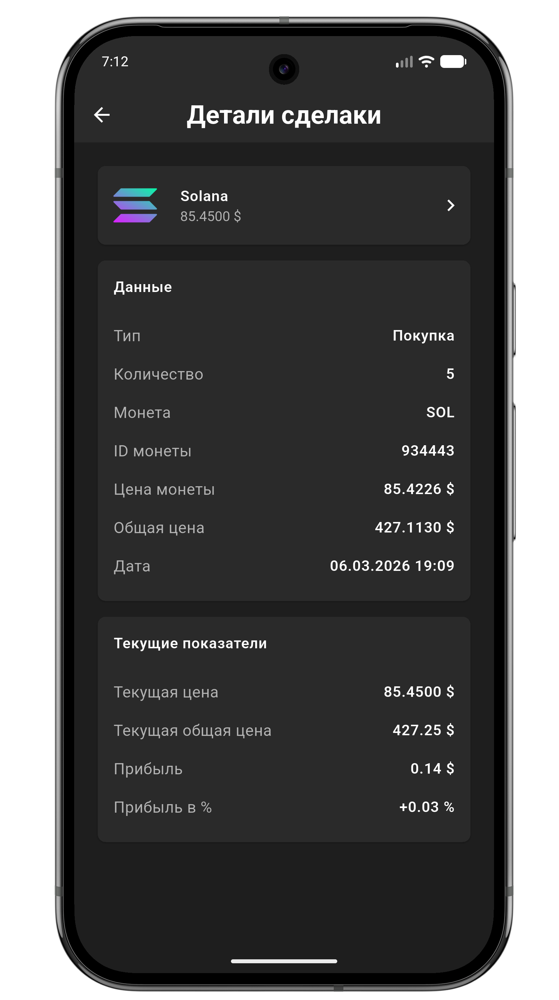

# Crypton

**Обучающий симулятор торговли криптовалютами, разработанный на Flutter.**  
Приложение позволяет пользователям изучить принципы работы крипторынка, практиковаться в торговле и управлять виртуальным портфелем без финансового риска.

Подходит как новичкам, которые только начинают знакомство с криптовалютами, так и более опытным пользователям, желающим отрабатывать инвестиционные стратегии в безопасной среде.

---

## 🚀 Функционал

✨ Основные возможности:
- 📊 Отслеживание актуальных курсов популярных криптовалют
- 💰 Покупка и продажа виртуальных монет по текущим рыночным ценам
- 📈 Управление виртуальным криптопортфелем
- 🧾 История операций и анализ сделок
- 🏆 Сравнение результатов с другими пользователями через рейтинги
- 📉 Анализ динамики портфеля


📱 Платформы:

- Android  
- iOS

---

## 🛠️ Технологии

- **Flutter / Dart**
- **Riverpod** — управление состоянием
- **AutoRoute** — навигация
- **Dio** — работа с API
- **Firebase**
  - Authentication
  - Cloud Firestore
- **fl_chart** — графики
- **Sqflite** — локальная база данных

---

## 📂 Установка и запуск

1️⃣ Клонирование репозитория

```bash
git clone https://github.com/username/crypto-simulator.git
cd crypto-simulator
```

2️⃣ Установка зависимостей

```bash
flutter pub get
```

3️⃣ Запуск проекта

```bash
flutter run
```

---

## 📌 Структура проекта

```bash
lib/
├── main.dart
├── app/
│   ├── router/
│   ├── runner/
│   ├── widgets/
│   └── app.dart
├── core/
│   ├── constants/
│   ├── theme/
│   └── utils/
├── data/
│   ├── data_sources/
│   ├── models/
│   └── repositories/
├── features/
│   ├── auth/
│   ├── briefcase/
│   ├── history/
│   ├── home/
│   ├── market/
│   ├── rating/
│   └── settings/
├── generated/
└── l10n/
```

---

   


